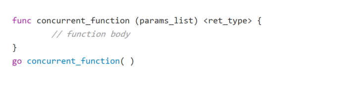
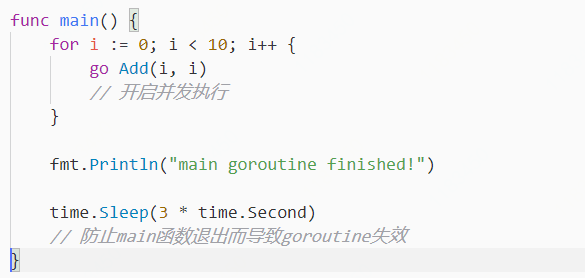
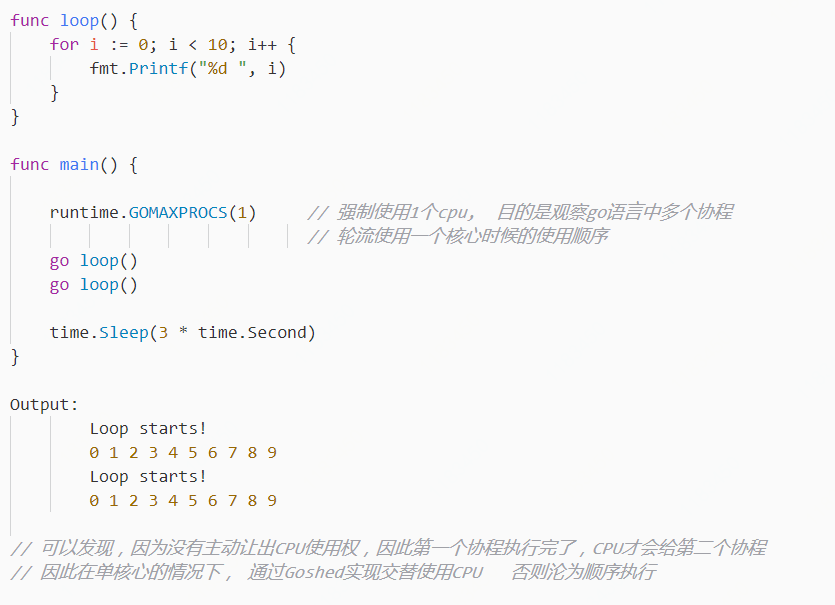

# goroutine & go - 一个简单的例子

> Introduction  
>   
> 轻松开启高并发性一直是go语言非常自豪的地方，go语言通过开启多条goroutine来做到实现高并发  
> 这其中一条goroutine就是一个协程\(用户态线程\)，而打开goroutine的正是这个叫做 **`go`** 的关键字

## go 关键字的基础知识

* 只要在被调用函数前面加上一个 **`go`** 关键字，就可以轻松开启并发执行
* 这次调用会在一个新的协程中并发执行，**负责调用这个函数的那个线程，也会继续执行**
* 当被go调用的函数返回时，这个协程就自动结束了，就算这个函数**有返回值，自动丢弃**
* golang程序会从main函数开始执行，**当main函数返回时，程序终止，不等待其他协程结束**

#### go 协程使用实例

1. add函数的执行结果会直接影响for循环的执行次数
2. 执行结果具有随机性,  看上去的确是在并发执行着

## go语言中的并发 :  单核心 + 多协程

* **Golang的`runtime`包用于调度各个`goroutine`协程 , `runtime.GOMAXPROCS(n)`用于控制核心数**
* **假设现在是单核CPU**,  那么所有协程全都在一个CPU核心里轮流执行
* 如果当前的协程不发生阻塞,  它是不会主动让出CPU的使用权的, 除非主动调用 `runtime.Goshed()`
* **如果当前协程发生了阻塞**,  相比于之前学习的,  **go程序会自动让出CPU给其他协程使用**

#### go并发,  单核心 + 多协程 案例

## go语言中的并行: 多核心 + 多线程

在以上案例中,  通过增大 runtime.GOMAXPROCS\(n\) 增加核心数量,  可以实现真正的并行  
并像之前那样,  结果会出现一定的随机性,  像是真正的并发一样

