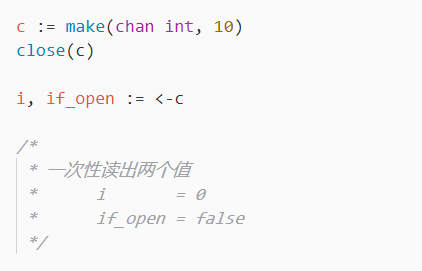

# 关闭管道

### 关闭后不能发送消息

在一条管道没有任务的时候，可与通过使用自带的close方法将管道关闭。如果一个管道已经被关闭，但是你仍然尝试往里面发送消息，报错：panic, send on closed channel

### 关闭后可以一直读

```go
c := make(chan int, 10)
c <- 1
c <- 2
close(c)
fmt.Println(<-c) // val : 1
fmt.Println(<-c) // val : 2
fmt.Println(<-c) // val : 0
fmt.Println(<-c) // val : 0
```

### 通过for循环取消息的会跳出循环


这里介绍了一种循环读消息的方式，不同于遍历数组或者遍历字典  
仍然存在一种range遍历管道的方式，这种方式能遍历出管道里所有消息  
**并且能做到，在管道已经关闭的前提下，遍历完成以后自动退出range循环**


```go
c := make(chan int, 10)
c <- 1
c <- 2
close(c)

for i := range c {
	fmt.Println(i)
	// c管道已经关闭，遍历完管道以后能够自动退出循环
}
```

### 查看一个管道是否已经关闭




