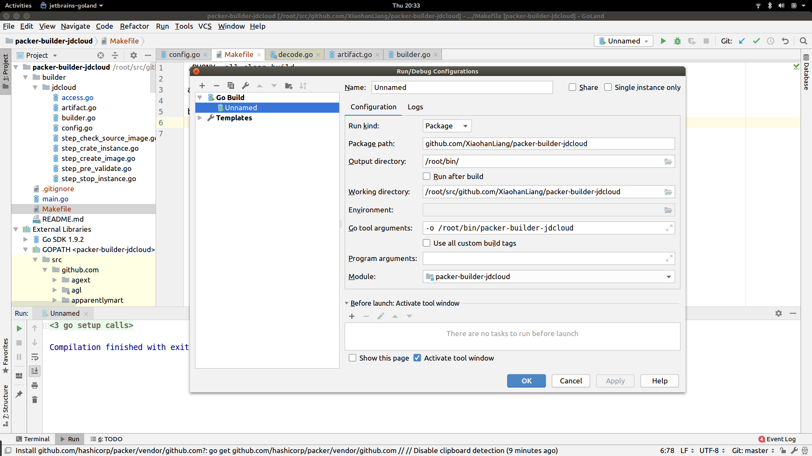

# Goland Specs

### What if my folder cannot be recognized as a project

When folder cannot be recognized as a project. The background of this folder turns into yellow, thus cannot deploy `make build` upon , restart Goland through **Application Center** instead of using `terminal command:land XXX` or `open from File->Open->...`

### What if compiler told me "Cannot import XXX" when they actually exists

Modify **GOPATH in Goland**. Package location usually appears in the form of "github.com/XX/YY", for sure, these package usually locates at `/root/src`. Hence modify `File -> Settings -> Go -> GOPATH -> Project Path -> Add "/root/src"`

