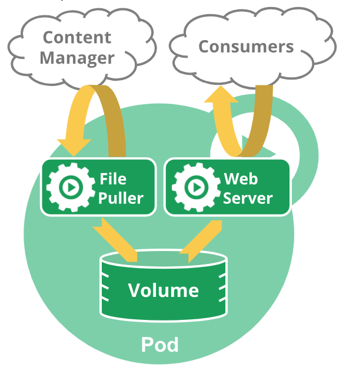
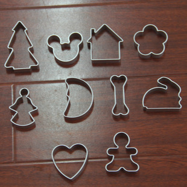

# Pods


这里的所有内容均由我翻译自官网文档，目的在于正确理解K8s相关概念


## Pod是干什么的，Pod里面有什么

一个Pod用于完成App内一个独立的功能，是K8s里最小的部署单位。Pod里包含： 容器，存储资源，IP。

### 什么是 Replicated-Pod 

“一个Pod代表了一个进程”  -  对于这句话的理解是，假设我们现在需要某种App，比如提供算时间的服务，通常情况下你直接在机器上运行这个算时间的App就可以了。但是这种常规的做法面临一种问题就是如果请求数量特别多的时候，会卡住。 面对这种情况，K8s选择将这个App同时运行好几份，一起承担起算时间的服务。一个Pod上运行一个这样的App， 然后运行很多个这样的Pod，这种操作在K8s里面叫做Replicas。这种App多备份的操作通常是由controller来做的

## 关于Pod是如何处理多容器的

绝大多数时候我们都只往Pod里封装一个容器，但是，如果两个容器功能是“紧密耦合”的，我们也有可能往Pod里封装几个容器。同一个Pod里的容器坐落于同一台机器上。 并且因为Pod是K8s集群内最小的管理单位，我们一次只会命令某个Pod怎么样怎么样，也就是说这些容器需要接受完全相同的管辖。

#### 他们需要共享Pod里的网络

每一个Pod都有一个自己独立的IP地址。但是容器之间关于网络资源是这么安排的：这些容器的IP全部一样，都是这个Pod的IP，但是端口可以自己决定。 如 `10.0.0.0:`**`80`** 以及 `10.0.0.0:`**`81`** 一样。 容器之间彼此沟通使用`localhost`

#### 他们需要共享Pod里的存储资源

Pod里所有的容器都共享一片内存，与此同时，就算Pod不在了，内存里的数据依旧可以保存下来，这样设计是防止Pod重启导致数据全部丢失

#### 什么是紧密耦合？多紧密才算紧密？

如下图所示，假设现在我想搞一个App做网页服务，那么，两个容器，一个负责往内存里加网页内容，另一个从内存里抽内容对外提供网页服务，两者协同对外统一成一个网页服务。



## 实际生产中我们是怎么做的

大部分时候你都不会在K8s集群创建一个单一的Pod. 关于Pod的理念我们都是希望它是那种短暂的，随意销毁的单位。 无论是你本人直接去创建Pod还是通过controller来创建，pod最终会创建在你集群中的一个Node\(工作机器上\)，一直到app任务结束了，这个pod也就被清除掉了。

#### 意外与故障

在故障情况中，Pod本身并不会自己去修复自己。如果Pod被安排到一个故障机上去创建，或者安排创建的过程本身就出现问题，或者工作机资源已经不够去创建一个pod，这个Pod就即将自动删除。

### 通过Controller管理你的Pod

K8s通过一种工具， 叫做controller，用于去直接创建那种周期短暂随意销毁的pod。因此如果你想直接去跟pod打交道，直接使用controller去创建这个pod就好。

controller用于创建管理多个pod，处理多备份操作来获得自动修复能力。这里的自动修复是指，如果一个工作机故障了，按理这台机子上的pod就不能再跑App了。 这种情况下controller马上在另一台机器上安排新的pod来接手它的任务。 至于你，管理者，你通过提供一份模板来定义pod的行为，controller就用这份模板来帮你管理pod

#### Pod模板又是啥

Pod都有自己的规格，比如叫啥名，容器要不要走镜像创建，你如果不想创建一个白Pod那就定义下模板吧。这个模板很有用的，不只是controller要用，Jobs还有DaemonSet都会用到这份模板。示例：



```yaml
apiVersion: v1
kind: Pod

metadata:
    name: example_pod
    labels:
        app: example_app
        
spec:
    containers:
    - name: example_app_container
      image: example_image
      command: ['sh','c','echo Hello K8s!']
```



#### Pod&模板之间什么关系

再多说一句，模板与pod之间的关系就像饼干与饼干模具之间的关系。 诚然，是模具塑造了饼干，但同时一旦饼干成型，饼干跟模具之间就再也没有任何关联了。假设我现在饼干已经成型了那我模具换不换形状跟这块饼干有什么关系。

同样的，你利用模板创造出20个pod出来，现在更换不换模板跟这20个pod有什么关系? 虽然你换模板的时候，pod不会变。但是pod是会频繁销毁重建的，也就是说接下来创建出来的pod就会按照新模板来走了。



