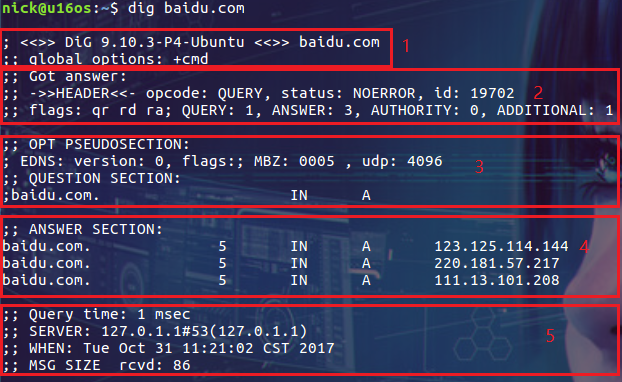

# dig

> dig命令主要用于从 DNS域名服务器 查询主机的地址信息
>
> ### 查询单个域名的DNS信息

```bash
$ dig baidu.com
```



1. dig命令的版本以及输入的参数
2. status是比较重要的信息，其中 NOERROR代表本次查询成功
3. QUESTION-SECTION 代表你本次想要查询什么域名
4. ANSWER-SECTION 代表本次查询的结果
5. 第五部分显示了本次查询的一些统计信息，包含用了多长时间，查询的是那个 DNS服务器 等

