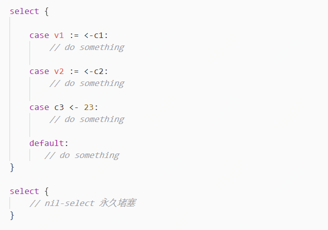
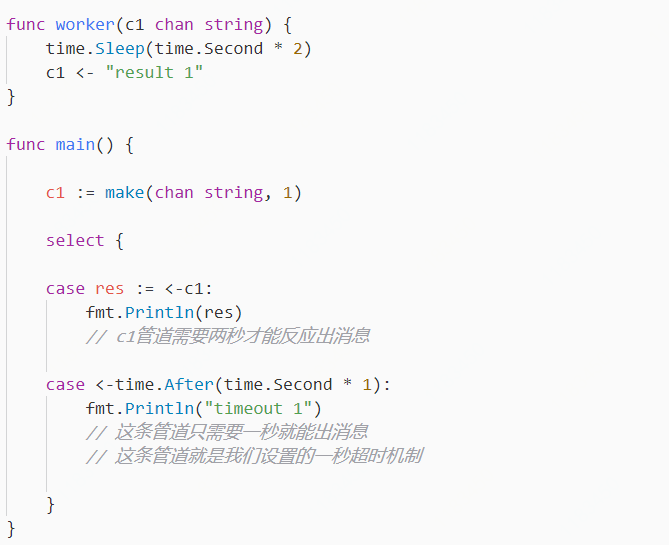

# 利用Select x Channel处理消息

## Introduction

Select选择一组可能的【Send】与【Receive】的操作去处理，形式上有点类似于switch，但是select仅仅用于处理管道通讯的操作。也就是说它的case只能是**发送消息**，**接收消息**或者是**default**操作

在接到select的时候，case语句会按照源码的顺序被依次评估，并且只会评估一次，评估结果如下：

1. 除default以外，如果只有一个case语句通过了，那么就执行这个case里的语句
2. 除default以外，如果有多个case语句通过了，那么会通过[伪随机](https://zh.wikipedia.org/wiki/%E4%BC%AA%E9%9A%8F%E6%9C%BA%E6%80%A7)的方式挑出其中一个来执行
3. 如果所有case全都没通过，那么执行default里的语句
4. 如果不仅所有case全都没通过，连default都没有，那么就会**堵在这个位置，直到某个case通过**
5. Select语句不是循环，**它最终只会选择其中一项来执行，执行完就结束select。这也说明就算多个case通过，也只会执行一个，其余的全部放弃**。若是想要一直处理channel，需要在外面加for

## 使用Select并设置超时机制

select有一个很重要的操作是超时处理，上面提到了如果没有case也没有default就会一直卡在这个位置，这意味着，在处理管道消息时，需要设置一个超时机制。示例如下：

为什么要用`time.Second` ?    Go语言中的1是指1 Nano Second  
为什么要用`time.After` ?      time.After\(n\)会在指定时间之后返回一个单向**管道**，管道里的消息是当前时间

