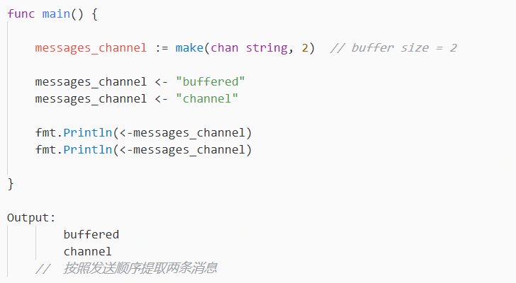

# Go管道

> 通道是用来连接并发，`goroutine` 的管道，从一条线程里的管道发送内容，另一个线程就可以收到

### 常用语法

`make(chan  message_type)` 创建一个管道，定义消息类型，注意这里使用空格来分隔

**`<-`**从管道的一头发送消息

**`<-channel`**从管道里接收消息，用一个变量接住这条消息

##  Go管道堵塞与缓冲区的设置

默认情况下Go语言是不带缓冲的。举个例子说明：假设某个协程现在想往管道里发送一条消息：`message_channel <- "testing message"` ，现在一定要有另一个协程从管道里提取了这条消息，这个协程才能往下走，否则就会一直在这里阻塞着

而带缓冲区的管道，允许消息的发送与接收保持异步状态，也就是说发送来的数据可以存在缓冲区里面，等待接收端去接收数据，不用立刻去取数据。但是管道缓冲区大小也是有一定限制的，如果消息条数的到达了管道上限却没协程取走这些消息，阻塞，直到消息被取走了才能继续执行下去


无缓冲   **==**   缓冲区当前可用容量为零   **==**  保持阻塞状态直到消息被取走


## 

