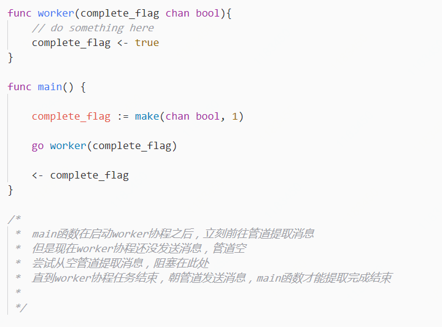

# 利用管道堵塞做一个同步

如果管道没有缓冲区，显然如果没有人来提取信息，协程就会卡在【发送消息这一步】

但是就算管道是有缓冲区的，也能做出阻塞&同步的效果  $$\rightarrow$$  **没人发送消息的情况下做提取的动作**

### 从这个性质做一个延伸多说几句

在上面的代码片段中，便于理解我们命名了一个`complete_flag`，而实际上它的名字叫做 `done_channel`  
这种管道的作用是**控制主线程，在支协程任务未完成之前不要先退出了**。

在并发程序中，通常main routine只是负责将任务分发给其他协程去完成，而自身仅仅是起到一个调度的作用。这种情况下，主函数并不知道其他协程完成情况如何，此时我们就需要一个管道，来告诉我们任务是否已经完成了。  我们可以控制粒度知道现在具体已经做到什么位置了

### References:       

1.      [Go管道同步教程](https://www.yiibai.com/go/golang-channel-synchronization.html)
2.      [Go语言并发模型 - quit Channel](https://segmentfault.com/a/1190000006815341#articleHeader6)      

